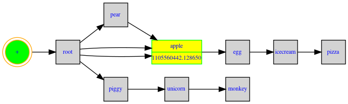

# iTree - an Interval Tree library


```eval_rst
.. toctree::
   :maxdepth: 2
   :hidden:

   tutorial
   changes
   recipes
```

In computer science, an `interval tree` is a tree data structure to hold intervals. Every node in `itree` has a `start` and an `end` value.

## Installation


Install ``itree`` by running::

  $ pip install py-itree

## Quick Start


```
  🟢  - normal node; 
  🔵  - zero interval node; 
  🍁  - leaf node, which means no child node
```

----

```
  >>> import itree
  >>> itree.Node('fruit', 0, 40)
  [🍁 n=fruit,s=0.00,e=40.00,x=0,c=0]
  >>> itree.Node('fruit')
  [🔵 n=fruit]
```

----

```
  >>> a=itree.Node('fruit', 0, 200)
  >>> b=itree.Node('apple', 10, 20)
  >>> print(a)
  [🍁 n=fruit,s=0.00,e=40.00,x=0,c=0]
  >>> a.append(b)
  >>> print(a)
  [🟢 n=fruit,s=0.00,e=200.00,x=0,c=1]
  >>> print(b)
  [🍁 n=apple,s=10.00,e=20.00,x=0,c=0]
  >>> print(a.nodes)
  [[🍁 n=apple,s=10.00,e=20.00,x=0,c=0]]
  >>> 
```

----

```

  🌳  - a tree

```


```python
  >>> from itree import Tree
  >>> def demo_tree():
        t = Tree(tid="123", extra={"img": "1241241313.png"})
        t.start("root", 1, {"name": "itree"})
        t.start("math", 2, {"age": 10})
        t.start("music", 3, {"location": [1, 2, 3]})
        t.end("music", 4, {"price": 12.3})
        t.end("math", 16284000, {"memory": (1, 2, 3)})
        t.start("music", 122840057.8713503)
        t.end("music", 1228400500)
        t.start("music", 32840057.8713503)
        t.start("egg", 3284.8713503)
        t.start("icecream", 32843.8713503)
        t.start("pizza", 32843.8713503)
        t.end("pizza", 62845003)
        t.end("icecream", 62845003)
        t.end("egg", 6284500)
        t.end("music", 628400500)
        t.start("piggy", 3284.8713503)
        t.start("unicorn", 32843.8713503)
        t.start("monkey", 32843.8713503)
        t.end("monkey", 62845003)
        t.end("unicorn", 62845003)
        t.end("piggy", 6284500)
        t.end("root", 1628400570.8713503)
        print(f"{t.count},{t.depth}")
        t.consolidate()
        img_path = t.to_img()
        return img_path, t
  >>> img_path, t = demo_tree()
  >>> t
  (🌳 id=123,c=11,x=1,d=6,m=0,o=1)
```

Run the `demo_tree()` function, a tree digraph will be generated:




## License


Tree is licensed under the Apache 2.0 License.
