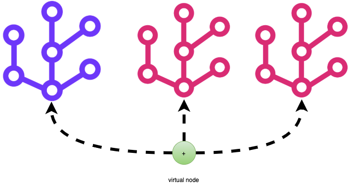

# Tutorial

## Concept

### Virtual Node

Virtual node is a special node which has name `None`, start and end values equal to `infinity`. You can use `create_virtual_node` to create a virtual node. It's useful when there are multiple trees and they need to be represented as one tree.



In case there are multiple virtual nodes, call `itree.consolidate(node)` to merge the virtual nodes into one.

## API

```eval_rst
 .. autoclass:: itree.Node

  .. automethod:: __init__

 .. autoclass:: itree.Tree

  .. automethod:: __init__

  .. automethod:: start

  .. automethod:: end

  .. automethod:: consolidate

  .. automethod:: to_img


 .. autoclass:: itree.ForestStats

```

